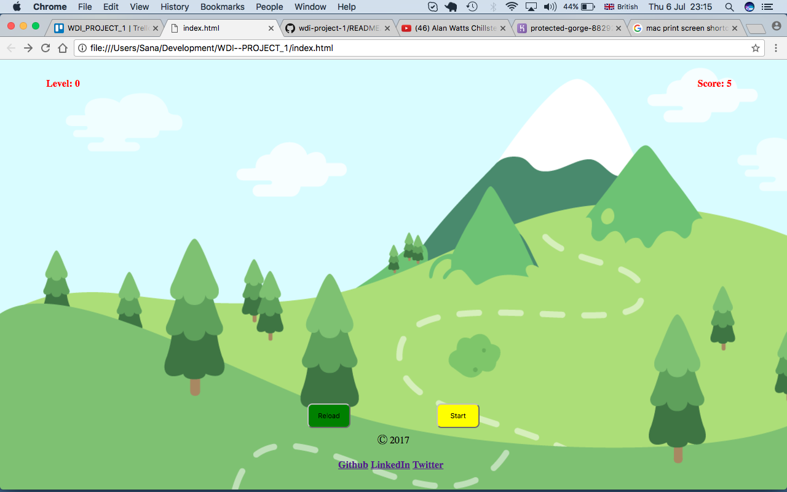
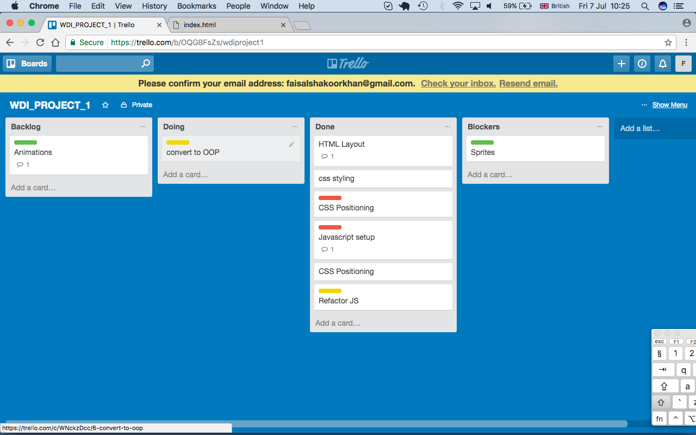

# WDI--PROJECT_1
**Credits: Faisal Khan**

**Game: Bird Hunter**




**Introduction:**

This is my first ever programming project for the WDI-28 course at General Assembly London.

Online game built using ES6 Javascript/JQuery for the logic, CSS3 for the layout, and HTML5 for the structure.


**Objectives:**

I was assigned to build an intresting hunting Game which gets harder as the gammer progress.

I was obviously inspired by a cult such as "shooting flying objects", which I then transformed in to this game.

**Rules:**

1. Shoot the bird with the help of mouse.
2. Every hit will give you 1 point and every miss-hit will be 	marked as negative.
3. Birds will come faster as the player leveled up.
4. Game will end when the score is zero.
5. The user is given a starting 5 points, which will either 	increase or decrease by 1 point depending on the bird hit or 	missed.

**Planning:**


The planning took place on a Friday, right after I'd chosen what game I was going to build.

I came out with a first guideline to follow, in order to build the game logic:

Think of a way for randomly generating the required number of birds in different Divs. Decreasing the bullets on every click and also reloaing them back with 5 bullets.
Increase Speed as the Level goes up.
Add styling.
Development

I'm now going to explain the logic of the game.

For generating the required moves I have basically generated a random number using Math.random, and I set the function to send birds every 6000ms using an intervall in the Div "rows".

```
function createDuck() {
  // the duck will be created and appended to a random row
  const $randomRow = $(pickRandomRow());
  const $duck       = $('<div class="duck"></div>');
  $randomRow.append($duck);
  $duck.on('click', handleClick);
  animateDuck($duck);
}
```
Then the game will check the score and increse the level and hence the speed and frequency of birds will increse.

```
function nextMove(){
  // generates a random number for the computer to choose the next required move;
function checkScore() {
  // check the value of score and either add a new level, or end the game
  if (score % 15 === 0) {
    level++;
    $('.level span').text(level);
    clearInterval(duckInterval);
    duckSpeed -= 1500;
    duckIntervalSpeed -= 70;
    duckInterval = setInterval(createDuck, duckIntervalSpeed);
  }
```
  


As soon as the bird is clicked it disappears from the screen,and as soon as the score hits 0 game ends.


```function clickedDuck(duck) {
  console.log('clicked');

  $(duck).stop().remove();
  blast();
  // definate a new animation to add to the top value of the duck
  score ++;
  $('.score span').text(score);
  checkScore();
}


Also if score falls to 0 it finishes the game.

  if (score <= 0 ) {
    console.log('game over');
    $('.duck').stop().remove();
    clearInterval(duckInterval);
  }
}
```

Also when the bullets gets reloaded once reload button gets pressed

```function handleClick(e) {
  e.stopPropagation();

  if (ammonition !== 0) {
    ammonition--;
    showBullets();
    if ($(e.target).hasClass('duck')) clickedDuck(e.target);
  } else {
    // play sound
  }
}

function addBullets() {
  if (ammonition === 0) {
    ammonition = 5;
    showBullets();
    reloaded();
  }
}
```
**Technologies**

**Javascript**

**HTML5**

**CSS3**

**jQuery**

